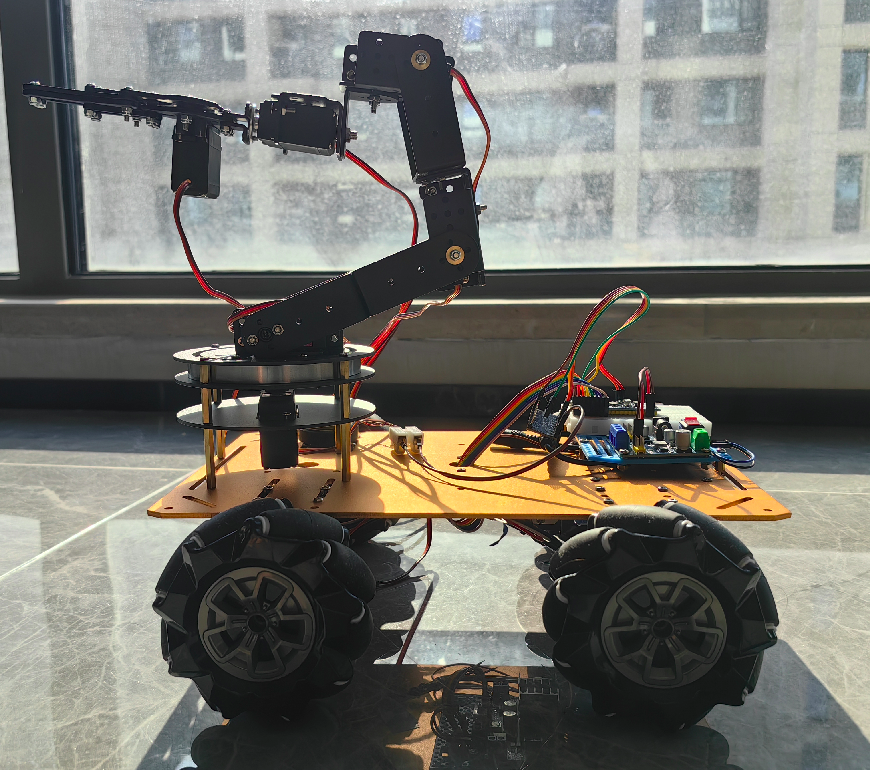

# AGO
AGO: AI GOGO

AGO is a voice controlled universal wheel car, and with a video automatic intelligent recognition system, which automatically controls the operation of the wheel and robotic arm. Also can be controlled using a mobile app.

AGO是语音控制万向轮小车，车载视频自动智能识别系统，自动控制机械臂工作，同时可以使用手机端APP进行控制。

## 功能说明
#### （1）语音控制小车行驶
可通过语音控制小车前进、后退、左转、右转、向左横向行驶，向右横向行驶，向左前、右前、左后、右后方向行驶。

#### （2）手机APP控制小车行驶
提供鸿蒙系统APP，通过APP控制小车行驶，同时同步摄像头实时画面。

#### （3）自动识别物体
通过车载摄像头自动识别、分类物体。可以根据目标物体进行搜索、锁定，并对移动目标物体进行跟踪。

#### （4）机械臂搬运物体
使用机械臂对物体进行夹起、转移、放下到指定范围区域等动作，实现物体搬运。搬运路径可规划也可自动学习。

## 设计说明

#### 硬件架构设计
- DIY小车，使用97mm万向轮加JGB37-520电机，L298N驱动板(四驱的，或者用两个两驱的)。
- 中控使用STM32F103C8T6单板。
- 语音控制使用asrpro。
- 机械臂使用普通舵机支架组装，舵机使用MG996R，PCA9685驱动。
- 视频及图像处理使用树莓派。
- 电源选择12V锂电充电电池。

详细参照：[硬件设计说明](hardware/README.md)

#### 软件架构设计
- 软件分语音识别处理、中控、视频及图像处理、手机APP四个子系统。
- 语音识别处理使用asrpro配套的天问五一开发IDE图形化开发。
- 中控软件基于stm32及freertos开发。控制小车及舵机驱动。语音与中控之间使用uart串口通信。
- 视频及图像处理基于PyTorchVideo开发，同时树莓派与中控建立IIC通信，反馈视频分析结果驱动小车和机械臂移动。
- 手机APP基于鸿蒙应用框架开发，控制指令同语音指令。通过树莓派热点与小车建立无线通信网络。HTTP协议通信。

详细参照：[软件设计说明和代码](software/README.md)

## 语音控制指令

| 命令关键字     | 功能                         | 命令ID |    指示灯|
| ------------ | --------------------------- | ------ | ------  |
| 停/别走了     | 小车停止                      |  0     |         |
| 前进/走       | 小车前进                      | 1     |         |
| 后退         | 小车后退                       |  2     |         |
| 往左走       | 小车向左横向走                  | 3     |         |
| 往右走       | 小车向右横向走                  | 4     |         |
| 往左前走     | 小车向左前方向斜着走             | 5     |         |
| 往右前走     | 小车向右前方向斜着走             | 6     |         |
| 往左后走     | 小车向左后方向斜着走             | 7     |         |
| 往右后走     | 小车向右后方向斜着走             | 8     |         |
| 左转        | 小车向左转                      | 9     |         |
| 右转        | 小车向右转                      | A     |         |
| 调头        | 小车调头                        | B     |         |
| 回来        | 小车向前一方向相反的方向行驶       | C     |         |
| 测试小车    | 测试小车                         | D     |         |
| 测试机械臂   | 测试机械臂                       | E     |         |
| 打开摄像头   | 打开摄像头                       | F     |         |
| 关闭摄像头   | 关闭摄像头                       | G     |         |
| 启动智能模式 | 启动智能模式                      | H     |         |
| 关闭智能模式 | 关闭智能模式                      | I     |         |

## 成品效果

##### 视频

##### 左视

##### 正视

##### 俯视

##### 后视

## 硬件模块及工具清单：

| 模块          | 说明                                                         | 价格(元) |
| ------------- | ------------------------------------------------------------ | -------- |
| STM32f103C8T6 | 控制单板，作为控制中心。                                        | 15       |
| 小车底盘       | 金属底盘，JGB 37 520电机带霍尔效应编码器，麦克纳姆万向轮             | 350       |
| L298N四驱板    | 四驱的L298N电机驱动                                           | 28       |
| 语音控制模块    | ASR PRO语音控制板                                             | 25       |
| 电源及转换板    | 12V电源，DC接口。 12V转5V和3.3V转换板。                         | 40       |
| 摄像头         | OV7725摄像头模块                                               | 10       |
| 机械臂         | 机械臂器件带舵机                                               | 200       |
| 舵机驱动       | PCA9685 16路舵机驱动                                          | 16       |
| 树莓派4B       | 树莓派4B用于图像识别和人工智能计算                                | 600       |

小车底盘、机械臂可以分开买，拼多多也有组装好的套件，组装好的套件贵一些，分开买便宜。
