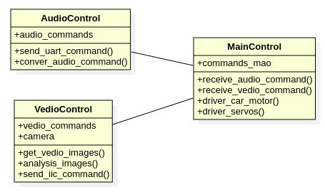
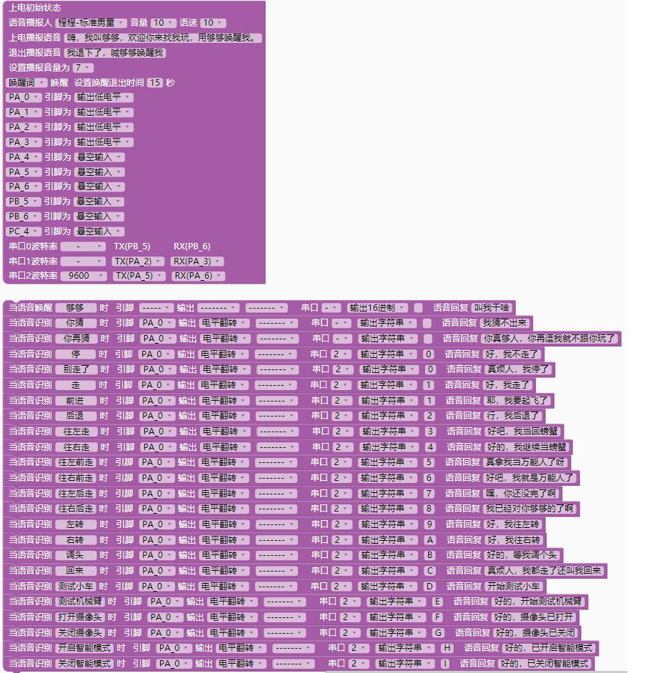

# Ago
Ago: AI gogo, the artificial intelligence universal wheel trolley, voice control, on-board video recognition robotic arm.

Ago是语音控制万向轮小车，车载视频自动识别机械臂。

## 功能说明
### 语音控制小车行驶
可通过语音控制小车前进、后退、左转、右转、向左横向行驶，向右横向行驶，向左前、右前、左后、右后方向行驶。

### 自动识别物体
通过车载摄像头自动识别、分类物体，语音播报物体名称。

### 机械臂搬运物体
使用机械臂对物体进行夹起、转移、放下到指定范围区域等动作，实现物体搬运。

### 遥控舵机云台变换灯光角度
将LED灯组放置云台，可以通过云台控制灯光方向。

## 设计说明

#### 硬件设计


详细参照：[硬件设计说明](hardware/README.md)


#### 软件设计



详细参照：[软件设计说明和代码](software/README.md)


## PS2按键功能

| 命令关键字     | 功能                         | 命令ID |    指示灯|
| ------------ | --------------------------- | ------ | ------  |
| 停/别走了     | 小车停止                      |  0     |         |
| 前进/走       | 小车前进                      | 1     |         |
| 后退         | 小车后退                      |  2     |         |
| 往左走       | 小车向左横向走                  | 3     |         |
| 往右走       | 小车向右横向走                  | 4     |         |
| 往左前走     | 小车向左前方向斜着走             | 5     |         |
| 往右前走     | 小车向右前方向斜着走             | 6     |         |
| 往左后走     | 小车向左后方向斜着走             | 7     |         |
| 往右后走     | 小车向右后方向斜着走             | 8     |         |
| 左转        | 小车向左转                      | 9     |         |
| 右转        | 小车向右转                      | A     |         |
| 回来        | 小车向前一方向相反的方向行驶      | B     |         |
| 调头        | 小车调头                        | C     |         |
| 测试机械臂   | 测试机械臂                       | D     |         |
| 打开摄像头   | 打开摄像头                       | E     |         |
| 关闭摄像头   | 关闭摄像头                       | F     |         |

详细参照下图：


## 成品效果

##### 视频

https://b23.tv/4TEsZSw


##### 正视


##### 俯视


##### 左视


## 硬件模块及工具清单：

| 模块          | 说明                                                         | 价格(元) |
| ------------- | ------------------------------------------------------------ | -------- |
| stm32f103     | 控制单板，作为控制中心。                                        | 110       |
| 小车底盘       | 金属底盘，JGB 37 520电机带霍尔效应编码器，麦克纳姆万向轮             | 350       |
| L298N四驱板    | 四驱的L298N电机驱动                                           | 28       |
| 语音控制模块    | ASR PRO语音控制板                                             | 25       |
| 电源          | 12V电源，DC接口                                               | 25       |
| 摄像头         | OV7725摄像头模块                                               | 10       |
| 机械臂         | 机械臂器件带舵机                                               | 200       |
| 舵机驱动       | PCA9685 16路舵机驱动                                          | 16       |
| 树莓派4B       | 树莓派4B用于图像识别和人工智能计算                                | 600       |

小车底盘、机械臂可以分开买，拼多多也有组装好的套件，组装好的套件贵一些，分开买便宜。


## 使用的相关工具软件：

#### OS： Ubuntu 20.04


#### 硬件设计工具KiCAD

安装：https://docs.kicad.org/5.1/zh/getting_started_in_kicad/getting_started_in_kicad.html


#### 软件设计开发工具:

- 软件设计工具： StarUML  https://staruml.io/download

- 开发IDE： VSCODE

- 编译软件： arm-none-eabi-gcc, cmake

ubuntu下安装： apt install arm-none-eabi-gcc

- 烧录软件stlink
```shell
# 安装依赖
$ sudo apt-get install libusb-1.0
$ sudo apt-get install cmake
$ sudo apt-get install libgtk-3-dev

# 安装
$ git clone https://github.com/stlink-org/stlink
$ cd stlink
$ cmake
$ make
$ cd bin
$ sudo cp st-* /usr/local/bin
$ cd ../lib
$ sudo cp *.so* /lib32
$ cd ../..
$ sudo cp config/udev/rules.d/49-stlinkv* /etc/udev/rules.d/
$ st-flash --version
        v1.7.0
```

- 依赖： python3, python-pip3, python serial

安装python serial: https://www.geeksforgeeks.org/how-to-install-python-serial-package-on-linux/

如果执行报错： usr/bin/env: ‘python’: No such file or directory

执行以下命令解决： sudo ln -s /usr/bin/python3 /usr/bin/python

- 串口调试工具： comtool

安装： sudo pipe3 install comtool


# 参考
https://github.com/larriti/stm32f10x-template