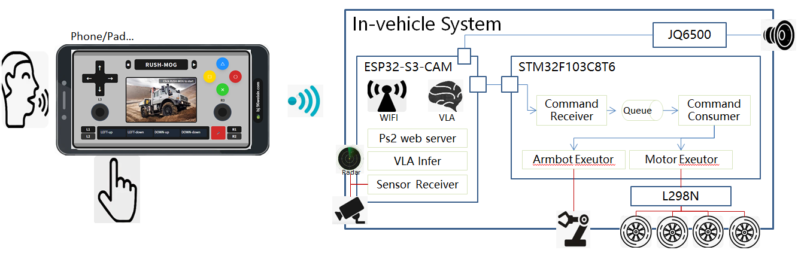
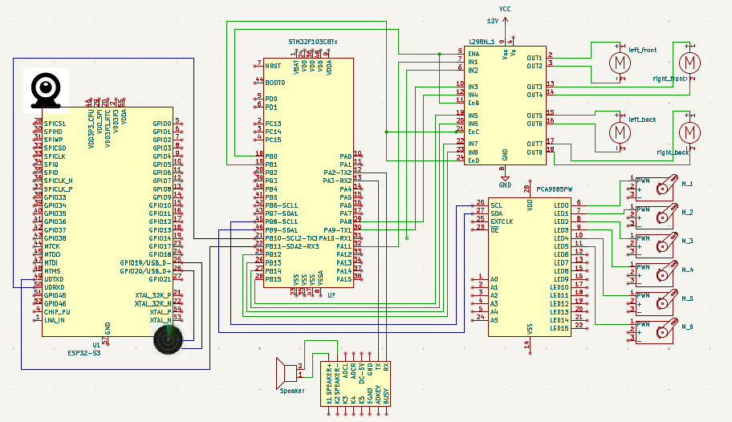
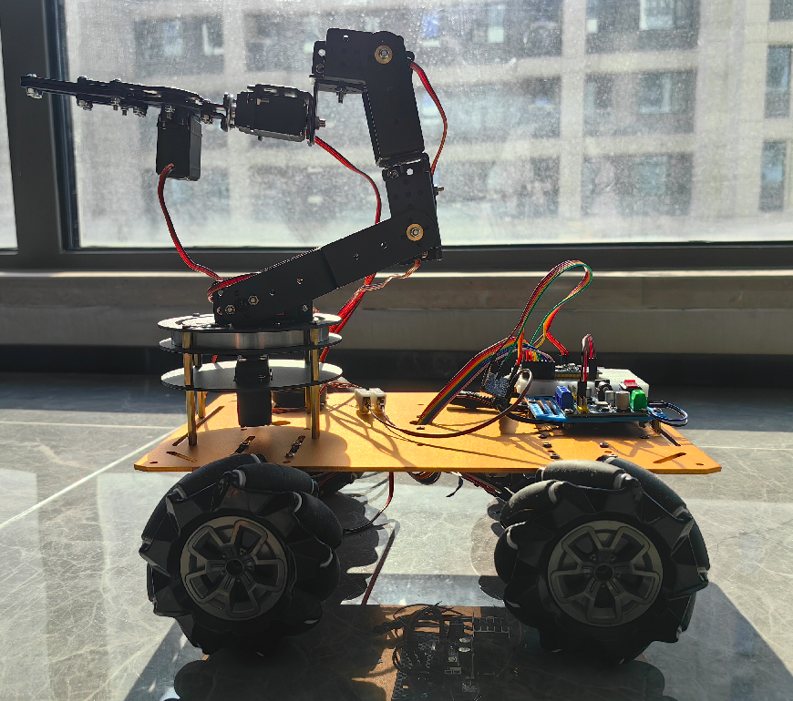
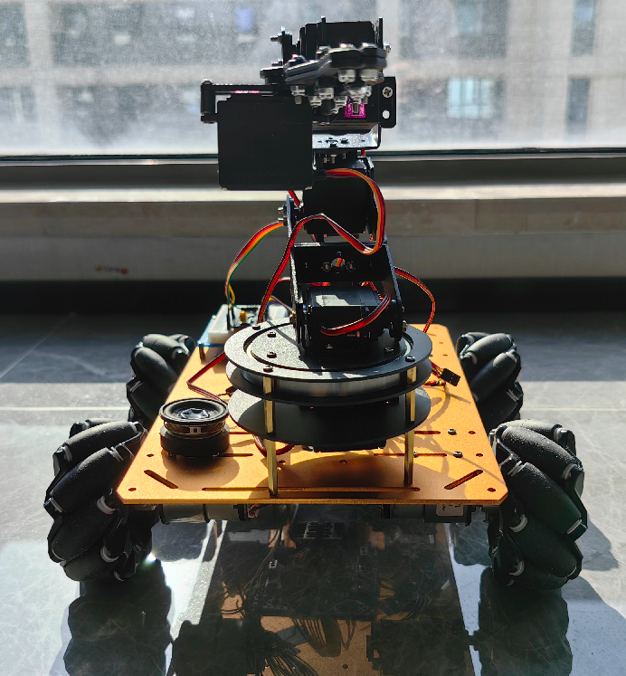
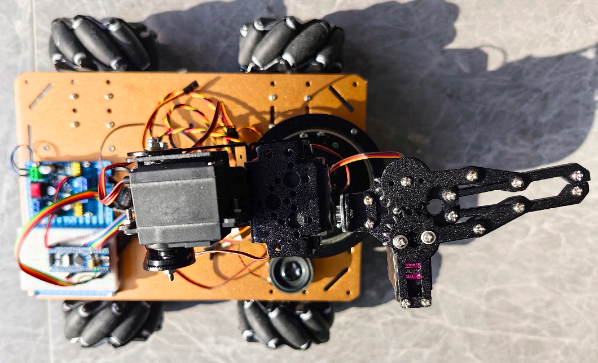
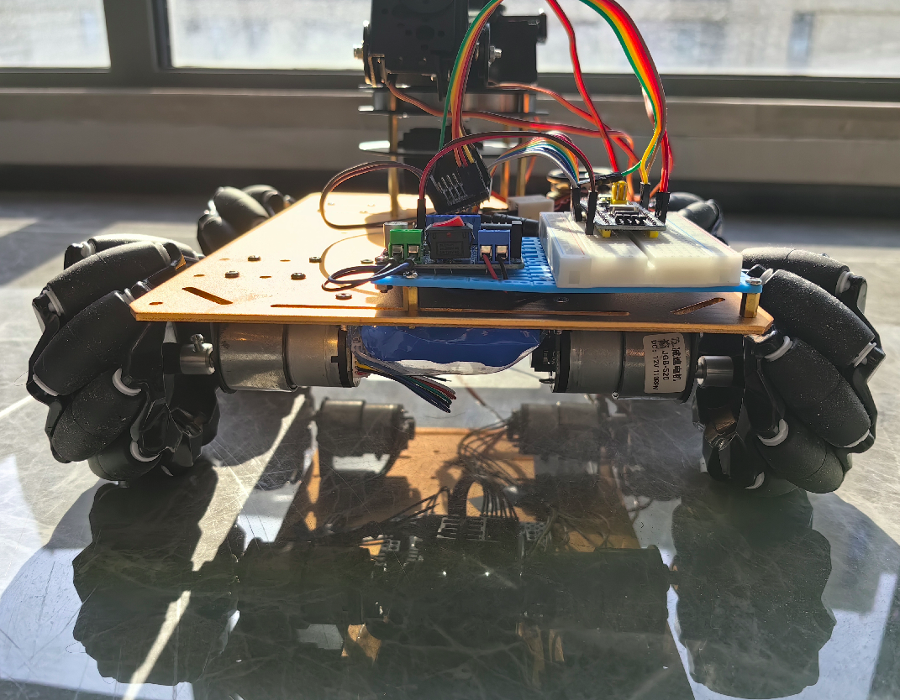

# Rush Mog
Rush Mog是一款致敬Unimog的VLA控制的智能万向轮小车。基于esp32 + stm32f103 + L298N + ov2640 + 激光雷达，实现支持ESP32实现手机WIFI的PS2或语音直接控制，VLA智能控制三种模式，并支持机械臂操作的智能小车。

## 功能说明
#### （1）语音控制小车行驶
可通过语音控制小车前进、后退、左转、右转、向左横向行驶，向右横向行驶，向左前、右前、左后、右后方向行驶。

#### （2）手机模拟PS2控制小车行驶
可通过手机模拟PS2控制小车前进、后退、左转、右转、向左横向行驶，向右横向行驶，向左前、右前、左后、右后方向行驶。

#### （3）自动识别物体
通过车载摄像头和机载激光雷达自动识别、分类物体。可以根据目标物体进行搜索、锁定，并对移动目标物体进行跟踪。

#### （4）机械臂搬运物体
使用机械臂对物体进行夹起、转移、放下到指定范围区域等动作，实现物体搬运。搬运路径可规划也可自动学习。

#### （5）VLA控制
使用VLA模型控制车体移动 + 机械臂搬运物体。

## 设计说明
#### 总体系统架构

总体原理说明：
1 通过esp32实现web server，提供PS2控制页面、语音输入操作。
2 esp32接收PS2指令直接下发stm32进行操作。
3 esp32接收语音指令进行识别，转换指令后下发stm32进行操作。
4 esp32接ov2640摄像头和激光雷达，运行轻量化vla模型进行推理。推理结果指令下发stm32。
5 stm32作为车体控制中心，将操作指令转换为具体的GPIO电位或PWM，对接L298N驱动小车电机，或对接机械臂驱动，执行命令。

#### 硬件架构设计
- DIY小车，使用97mm万向轮加JGB37-520电机，L298N驱动板(四驱的，或者用两个两驱的)。
- 中控使用STM32F103C8T6单板。
- 语音控制使用asrpro。
- 机械臂使用普通舵机支架组装，舵机使用MG996R，PCA9685驱动。
- 视频及图像处理使用OpenMV+GY-530 VL53L0X TOF测距。
- 激光雷达，YDLIDAR激光雷达。
- 电源选择12V锂电充电电池。

详细参照：[硬件设计说明](hardware/README.md)

#### 软件架构设计
- 软件分语音识别处理、中控、视频及图像处理、手机APP四个子系统。
- 语音识别处理使用asrpro配套的天问五一开发IDE图形化开发。
- 中控软件基于stm32及freertos开发。控制小车及舵机驱动。语音与中控之间使用uart串口通信。
- 视频及图像处理基于PyTorchVideo开发，同时树莓派与中控建立IIC通信，反馈视频分析结果驱动小车和机械臂移动。
- 手机APP基于鸿蒙应用框架开发，控制指令同语音指令。通过树莓派热点与小车建立无线通信网络。HTTP协议通信。

详细参照：[软件设计说明和代码](software/README.md)

## 控制指令

| 语音命令      | 手柄命令              | 功能                         | 命令ID |    指示灯|
| ------------ | --------------------- | -------------------------- | ------ | ------  |
| 停/别走了     | 松开左侧所有按钮       | 小车停止                      |  0     |         |
| 前进/走      | ↑ 键，或左摇杆向上      | 小车前进                      |  1     |         |
| 后退         | ↓ 键，或左摇杆向下      | 小车后退                      |  2     |         |
| 往左走       | ← 键，或左摇杆向左      | 小车向左横向走                 |  3     |         |
| 往右走       | → 键，或左摇杆向右      | 小车向右横向走                 |  4     |         |
| 往左前走     | 左摇杆向左上            | 小车向左前方向斜着走            |  5     |         |
| 往右前走     | 左摇杆向右上            | 小车向右前方向斜着走            |  6     |         |
| 往左后走     | 左摇杆向左下            | 小车向左后方向斜着走            |  7     |         |
| 往右后走     | 左摇杆向右下            | 小车向右后方向斜着走            |  8     |         |
| 左转         | L1按钮                 | 小车向左转                     | 9     |         |
| 右转         | R1按钮                 | 小车向右转                     | A     |         |
| 左调头       | L2按钮                 | 小车从左侧调头                 | B     |         |
| 右调头       | R2按钮                 | 小车从右侧调头                 | C     |         |
| 测试小车     | START 键               | 测试小车                       | D     |         |
|             |  △ 键                 | 加速                           | E     |         |
|             |  × 键                  | 减速                           | F     |         |
|             |  □ 键                  | 向左微转                       | G     |         |
|             |  ○ 键                  | 向右微转                       | H     |         |
|             |  松开 □ 或 ○ 键        | 恢复直行                        | I     |         |
|             |  SELECT 键             | 小车重新初始化                  | J     |         |

## 手柄使用办法

启动小车后，使用手机连接RUSH-MOG WIFI。连接成功后打开手机浏览器，输入192.168.4.1，打开PS2手柄页面，操控小车。

## 成品效果

##### 视频
[https://www.bilibili.com/video/BV1Db4y1V7Ny](https://www.bilibili.com/video/BV1Db4y1V7Ny)

##### 左视

##### 正视

##### 俯视

##### 后视

## 硬件模块及工具清单：

| 模块          | 说明                                                         | 价格(元) |
| ------------- | ------------------------------------------------------------ | -------- |
| STM32f103C8T6 | 控制单板，作为控制中心。                                        | 15       |
| 小车底盘       | 金属底盘，JGB 37 520电机带霍尔效应编码器，麦克纳姆万向轮             | 350       |
| L298N四驱板    | 四驱的L298N电机驱动                                           | 28       |
| 语音控制模块    | ASR PRO语音控制板                                             | 25       |
| 电源及转换板    | 12V电源，DC接口。 12V转5V和3.3V转换板。                         | 40       |
| 摄像头         | OV7725摄像头模块                                               | 10       |
| 机械臂         | 机械臂器件带舵机，这里用的最普通的MG996舵机，再好一点用串行总线舵机，再贵一点的用伺服电机，但后面的都比较贵了。                                               | 200       |
| 舵机驱动       | PCA9685 16路舵机驱动                                          | 16       |
| OpenMV       | 视觉智能开发板                                              | 300       |
| OLED屏       | OLED屏，用来显示调试/监控信息                                 | 10       |
| TOF测距       | OpenMV扩展，弥补OpenMV在测距方面的不足                        | 10       |
| 陀螺仪        | MPU6050，用来监控小车方向                                     | 15       |
| ESP8266        | 用来创建WIFI网络，连接手机APP                               | 15       |
