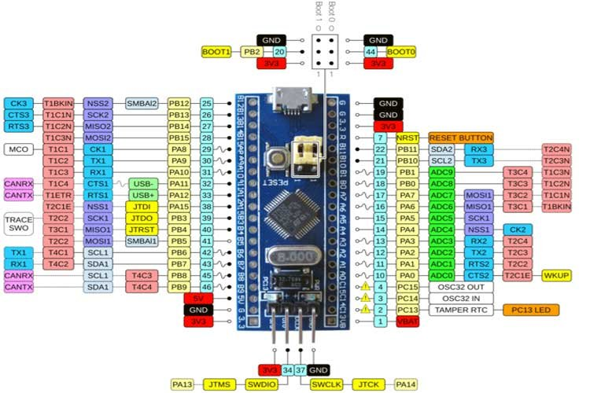
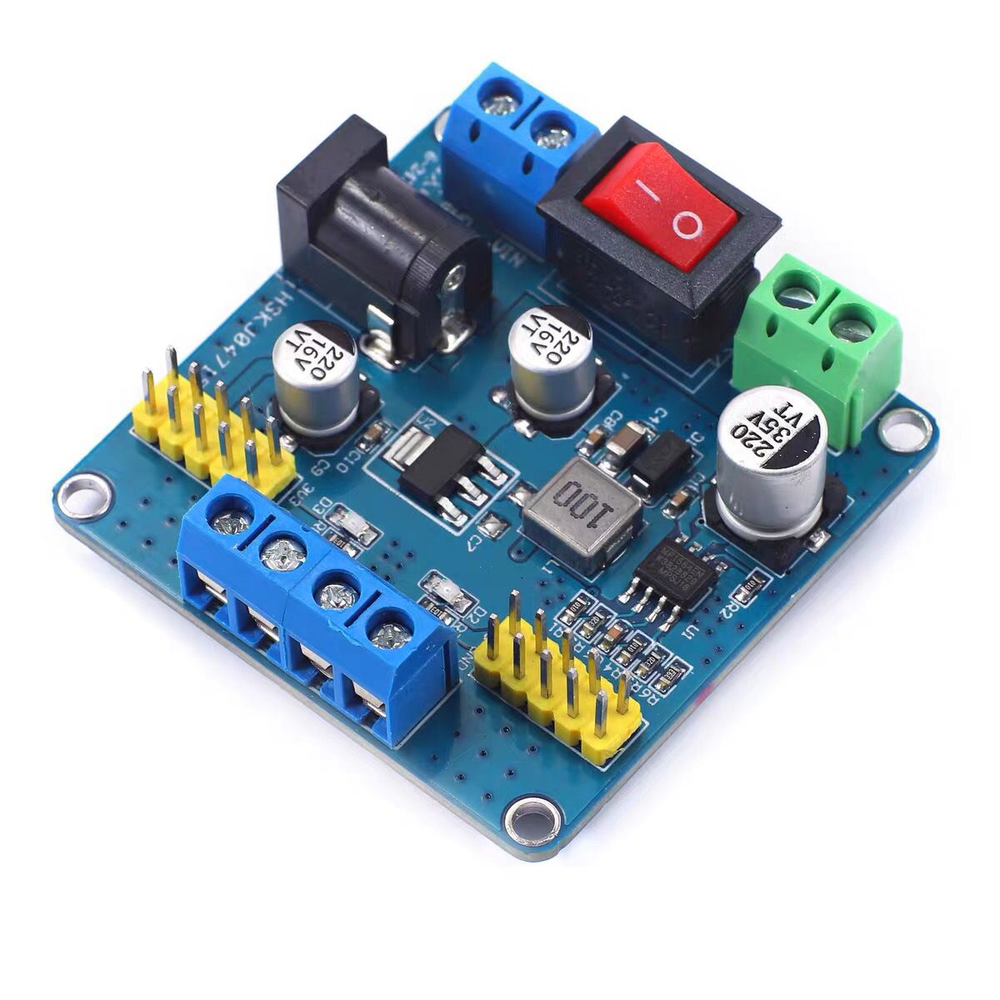
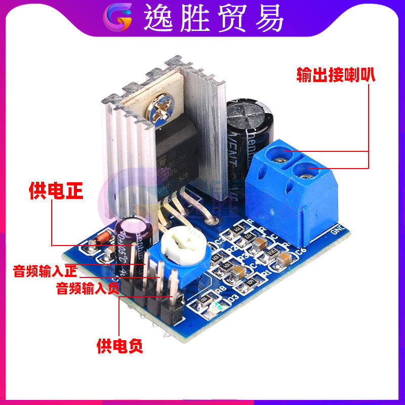

## 整体设计

其它说明：树莓派U口接摄像头。

## 模块说明

#### 语音识别模块

使用语音识别模块进行语音识别，转换成控制小车的指令。控制命令说明：

| 命令关键字     | 功能                         | 命令ID |    指示灯|
| ------------ | --------------------------- | ------ | ------  |
| 停/别走了     | 小车停止                      |  0     |         |
| 前进/走       | 小车前进                      | 1     |         |
| 后退         | 小车后退                      |  2     |         |
| 往左走       | 小车向左横向走                  | 3     |         |
| 往右走       | 小车向右横向走                  | 4     |         |
| 往左前走     | 小车向左前方向斜着走             | 5     |         |
| 往右前走     | 小车向右前方向斜着走             | 6     |         |
| 往左后走     | 小车向左后方向斜着走             | 7     |         |
| 往右后走     | 小车向右后方向斜着走             | 8     |         |
| 左转        | 小车向左转                     | 9     |         |
| 右转        | 小车向右转                     | A     |         |
| 回来        | 小车向前一方向相反的方向行驶      | B     |         |
| 调头        | 小车调头                       | C     |         |

#### 控制中心-STM32单板

STM32单板作为中心控制单元，接收语音命令，转换成电机驱动指令下发到电机驱动。
同时对接树莓派，树莓派进行图像识别后传回控制指令到STM32， STM32根据指令驱动机械臂舵机。

IO口分配如下：
| GPIO         | 对接口                  | 作用说明          |   指示灯|
| ------------ | ---------------------- | ---------------- | ------  |
| PA11         | 电机驱动IN1             |  左前电机控制1     |         |
| PA10         | 电机驱动IN2             |  左前电机控制2     |         |
| PA9          | 电机驱动IN3             |  左后电机控制1     |         |
| PA8          | 电机驱动IN4             |  左后电机控制2     |         |
| PB15         | 电机驱动IN5             |  右前电机控制1     |         |
| PA14         | 电机驱动IN6             |  右前电机控制2     |         |
| PB13         | 电机驱动IN7             |  右后电机控制1     |         |
| PA12         | 电机驱动IN8             |  右后电机控制2     |         |
| PA2          | UART2 TX接ASR板PA6 RX  |  语音板串口通信     |         |
| PA3          | UART2 RX接ASR板PA5 TX  |  语音板串口通信     |         |
| PB6          | IIC通信接树莓派         |  树莓派通信        |         |
| PB7          | IIC通信接树莓派         |  树莓派通信        |         |
| PB8          | IIC通信接舵机驱动       |  舵机驱动通信      |         |
| PB9          | IIC通信接舵机驱动       |  舵机驱动通信      |         |

#### 小车底盘
小车底盘是拼多多淘的底盘+JGB37 520电机+万向轮组装。拼多多也有成套的，成套的更贵一点。

#### 电机驱动模块

使用L298N电机驱动，控制小车四个电机，四驱控制。

12V输入电压，5V输出电压为控制单板等其他模块供电。

#### 机械臂

机械臂从拼多多购买散件拼装，带6个180度舵机。

#### 舵机驱动pca9685

16路舵机驱动

#### 树莓派

树莓派4B+摄像头进行图像识别处理。

#### 电源及电压转换板
小车上有12V，5V， 3.3V三种电压，最好用12V供电电源，并用电压转换板转换一下。

#### 音频放大器
如果嫌声音小，可以这个放大器进一步放大音量。
