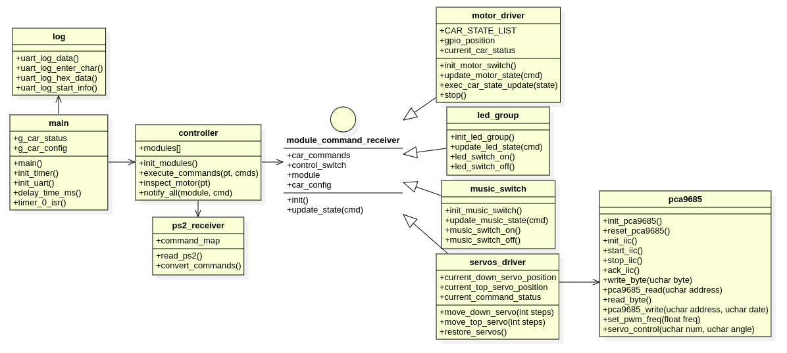

## 整体设计



## 代码结构说明
整体代码分五个模块，一个接口结构体和一个main函数。

controller：代表MCU，作中心控制，接收PS2数据，并把数据转换成命令通知给各驱动模块干活。

ps2_receiver： PS2接收模块，接收PS2传过来的数据，并转换成内部命令。

module_command_receiver： 命令接收执行工作模块接口，定义内部命令，抽象模块初始化和命令执行接口。

led_group： LED灯组模块，接收主控中灯光开关指令，根据PS2传递的指令切换灯组开关。

music_switch： 音乐驱动模块，接收主控中音乐相关指令，可控制音乐播放。

motor_driver： 电机驱动模块，接收主控中电机相关指令，控制底盘前进、后退、左转和右转。

servos_driver：舵机控制模块，接收主控中舵机相关指令，控制舵机前后、左右移动以及复位。

pca9685： 舵机驱动使能模块，通过IIC连接pca9685驱动，将servos_driver中的指令下到具体舵机上。


## 编译烧录：

第一步，编译：

```shell
$cd {work_path}/rucar/software/code
$mkdir build
$cd build
$cmake ..
$make
$ls src
```模块，接收主控中舵机相关指令，控制舵机前后、左右移动以及复位。

pca9685： 舵机使能


## 编译烧录：

第一步，编译：

```shell
$cd {work_path}/rucar/software/code
$mkdir build
$cd build
$cmake ..
$make
$ls src
```

如果个人娱乐不想写cmake文件，就下面这样

```shell
$sudo sdcc led_basic.c -o led_basic.ihx
```


第二步，转换成可烧录的hex文件：

```shell
$cd src
$packihx RUCAR.ihx > RUCAR.hex
```

第三步，烧录文件到MCU：

```shell
$sudo stcflash RUCAR.hex 
```


此命令会自动寻找USB口发命令。如果有多个USB口，需要指定相应端口。

```shell
$sudo stcflash RUCAR.hex --port /dev/ttyUSB0
```

## PS2通讯说明：

购买PS2后老板都会发教程和代码的。