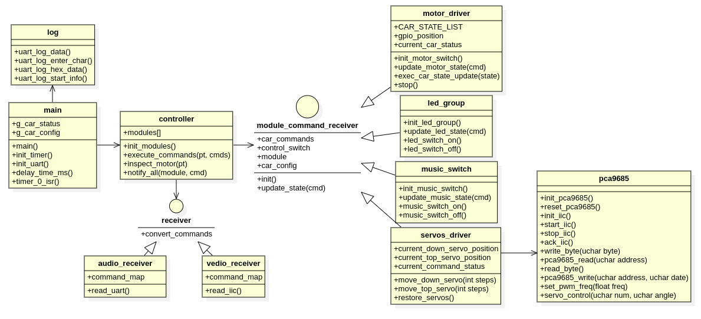

# 1 整体软件架构
Ago智能系统包括语音控制系统，主控制系统（包括机械臂控制），图像识别分析系统三个核心子系统。
- 语音控制系统，识别语音，将语音转换成执行指令，并将指令传给主控制系统，进行控制执行。
- 主控制系统，接收语音指令、图像识别指令对小车行进、摄像头运行状态、机械臂进行控制执行。
- 图像识别系统，驱动摄像头，对图像进行分析识别，形成控制指令传给主控制系统进行控制执行。


# 2 语音控制子系统
语音控制唤醒词：够够
命令如下：
| 命令关键字     | 功能                         | 命令ID |    指示灯|
| ------------ | --------------------------- | ------ | ------  |
| 停/别走了     | 小车停止                      |  0     |         |
| 前进/走       | 小车前进                      | 1     |         |
| 后退         | 小车后退                       |  2     |         |
| 往左走       | 小车向左横向走                  | 3     |         |
| 往右走       | 小车向右横向走                  | 4     |         |
| 往左前走     | 小车向左前方向斜着走             | 5     |         |
| 往右前走     | 小车向右前方向斜着走             | 6     |         |
| 往左后走     | 小车向左后方向斜着走             | 7     |         |
| 往右后走     | 小车向右后方向斜着走             | 8     |         |
| 左转        | 小车向左转                      | 9     |         |
| 右转        | 小车向右转                      | A     |         |
| 调头        | 小车调头                        | B     |         |
| 回来        | 小车向前一方向相反的方向行驶       | C     |         |
| 测试小车    | 测试小车                         | D     |         |
| 测试机械臂   | 测试机械臂                       | E     |         |
| 打开摄像头   | 打开摄像头                       | F     |         |
| 关闭摄像头   | 关闭摄像头                       | G     |         |
| 启动智能模式 | 启动智能模式                      | H     |         |
| 关闭智能模式 | 关闭智能模式                      | I     |         |

使用天问Block软件进行界面化编辑，如下图：


使用串口2向主控板通信，TX针脚：PA_5， RX针脚：PA_6，波特率： 9600

注：
- 1 编译和烧录通过天问BLOCK软件自动完成
- 2 可能会硬件不识别等问题，先换数据线试试。不行问天问社区

# 3 主控子系统
主控子系统功能：
- 1 接收语言控制指令
- 2 驱动小车电机，四个电机分别驱动，能够实现前进/后退/停止等动作
- 3 与树莓派/摄像头交互，传递控制指令，接收图像分析结果
- 4 驱动机械臂运动控制执行

类图设计：


# 4 图像识别子系统
图像识别子系统功能：
- 1 连接摄像头，实时采集图像数据
- 2 应用机器学习进行图像识别
- 3 对位置、距离进行识别
- 4 形成控制指令传给主控制系统

# 5 使用的相关工具软件：

#### OS： Ubuntu 20.04

#### 软件设计开发工具:

- 软件设计工具： StarUML  https://staruml.io/download

- 开发IDE： VSCODE

- 编译软件： arm-none-eabi-gcc, cmake

ubuntu下安装： apt install arm-none-eabi-gcc

- 烧录软件1: stlink
```shell
# 安装依赖
$ sudo apt-get install libusb-1.0
$ sudo apt-get install cmake
$ sudo apt-get install libgtk-3-dev

# 安装
$ git clone https://github.com/stlink-org/stlink
$ cd stlink
$ cmake
$ make
$ cd bin
$ sudo cp st-* /usr/local/bin
$ sudo cp -r ../../config/chips /usr/local/share/stlink
$ cd ../lib
$ sudo cp *.so* /lib32
$ cd ../..
$ sudo cp config/udev/rules.d/49-stlinkv* /etc/udev/rules.d/
$ sudo apt install stlink-tools
$ sudo apt install stlink-gui


$ st-flash --version
        v1.7.0

# 安装JLink
$ sudo apt install libreadline-dev

# 烧录软件
$ st-flash write STM32F10x-Template.bin 0x8000000
```
- 烧录软件2：flymcu的stm32flash
```shell
# 安装软件
$ sudo apt-get install stm32flash
$ sudo stm32flash -w STM32F10x-Template.hex -v -g 0x0 /dev/ttyUSB0
```


- 依赖： python3, python-pip3, python serial

安装python serial: https://www.geeksforgeeks.org/how-to-install-python-serial-package-on-linux/

如果执行报错： usr/bin/env: ‘python’: No such file or directory

执行以下命令解决： sudo ln -s /usr/bin/python3 /usr/bin/python

- 串口调试工具： comtool

安装： sudo pipe3 install comtool

# 问题与注意事项
- 1 中控的中断优先级一定要设置正确，否则有诡异问题。UART2的中断优先级要低于configLIBRARY_MAX_SYSCALL_INTERRUPT_PRIORITY配置（即数字比这个大）。另外一定要加这句：
```C
NVIC_PriorityGroupConfig(NVIC_PriorityGroup_4);           /* 设置优先级分组为4组，即抢占优先级范围为0-15 */
```

# 参考
https://github.com/larriti/stm32f10x-template

https://github.com/erhankur/stm32f103-bluepill