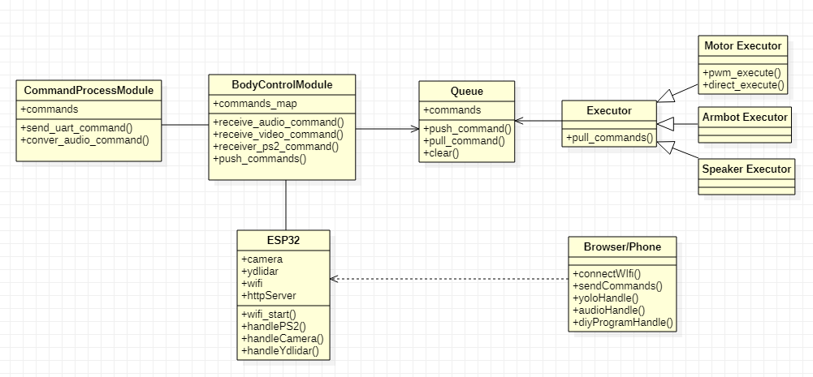
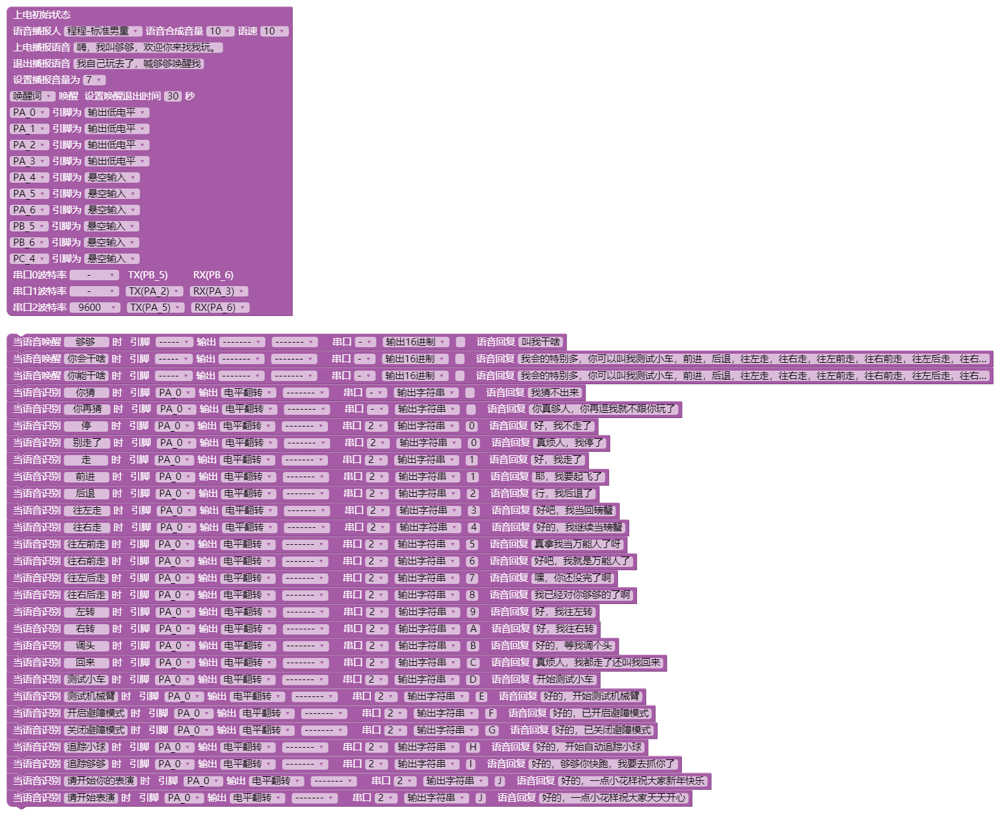
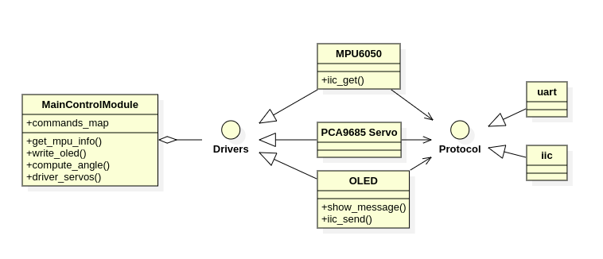

# 1 整体软件架构
RushMog智能系统包括语音控制系统，主控制系统（包括机械臂控制），视觉分析系统，远程控制中心系统四个核心子系统。
- 语音控制系统，识别语音，将语音转换成执行指令，并将指令传给主控制系统，进行控制执行。
- 车体控制系统，接收语音指令、图像识别指令对小车行进、摄像头运行状态、机械臂进行控制执行。
- 视觉分析系统，驱动摄像头，对图像进行分析识别，形成控制指令传给主控制系统进行控制执行。提供WIFI，并将图像结果等反馈给远程控制中心。
- 远程控制中心系统，通过WIFI连接视觉系统，控制视觉系统接收指令，并接收视觉系统反馈及图像结果。

# 2 语音控制子系统
语音控制唤醒词：够够
命令如下：
| 语音命令      | 手柄命令              | 功能                         | 命令ID |    指示灯|
| ------------ | --------------------- | -------------------------- | ------ | ------  |
| 停/别走了     | 松开左侧所有按钮       | 小车停止                      |  0     |         |
| 前进/走      | ↑ 键，或左摇杆向上      | 小车前进                      |  1     |         |
| 后退         | ↓ 键，或左摇杆向下      | 小车后退                      |  2     |         |
| 往左走       | ← 键，或左摇杆向左      | 小车向左横向走                 |  3     |         |
| 往右走       | → 键，或左摇杆向右      | 小车向右横向走                 |  4     |         |
| 往左前走     | 左摇杆向左上            | 小车向左前方向斜着走            |  5     |         |
| 往右前走     | 左摇杆向右上            | 小车向右前方向斜着走            |  6     |         |
| 往左后走     | 左摇杆向左下            | 小车向左后方向斜着走            |  7     |         |
| 往右后走     | 左摇杆向右下            | 小车向右后方向斜着走            |  8     |         |
| 左转         | L1按钮                 | 小车向左转                     | 9     |         |
| 右转         | R1按钮                 | 小车向右转                     | A     |         |
| 调头         | L2                     | 小车调头                       | B     |         |
| 回来         | R2                     | 小车向前一方向相反的方向行驶    | C     |         |
| 测试小车     |                        | 测试小车                       | D     |         |
|             |  △ 键                 | 加速                           | E     |         |
|             |  × 键                  | 减速                           | F     |         |
|             |  □ 键                  | 向左微转                       | G     |         |
|             |  ○ 键                  | 向右微转                       | H     |         |
|             |  松开 □ 或 ○ 键        | 恢复直行                        | I     |         |

使用天问Block软件进行界面化编辑，如下图：

使用串口2向主控板通信，TX针脚：PA_5， RX针脚：PA_6，波特率： 9600

注：
- 1 编译和烧录通过天问BLOCK软件自动完成
- 2 可能会硬件不识别等问题，先换数据线试试。不行问天问社区

# 3 车体控制子系统
车体控制子系统功能：
- 1 接收语言控制指令
- 2 驱动小车电机，四个电机分别驱动，能够实现前进/后退/停止等动作
- 3 与树莓派/摄像头交互，传递控制指令，接收图像分析结果
- 4 驱动机械臂运动控制执行

类图设计：

# 4 图像识别子系统
图像识别子系统功能：
- 1 连接摄像头，实时采集图像数据
- 2 应用机器学习进行图像识别
- 3 对位置、距离进行识别
- 4 形成控制指令传给主控制系统

# 5 使用的相关工具软件：

#### OS： Ubuntu 20.04

#### 软件设计开发工具:

- 软件设计工具： StarUML  https://staruml.io/download

#### 开发环境说明
- [车体控制系统](body_control/README.md)
- [语音系统](audio_control/README.md)
- [远程控制系统](remote_center/README.md)