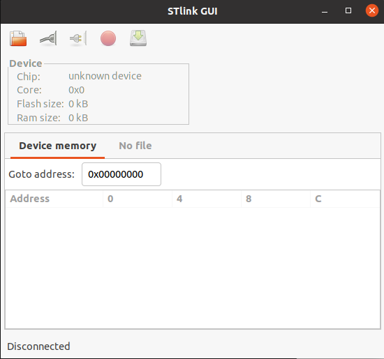

# 开发环境说明
- 开发IDE： VSCODE

- 编译软件： arm-none-eabi-gcc, cmake

ubuntu下安装： apt install arm-none-eabi-gcc

- 烧录软件1: stlink
```shell
# 安装依赖
$ sudo apt-get install libusb-1.0
$ sudo apt-get install cmake
$ sudo apt-get install libgtk-3-dev

# 安装
$ git clone https://github.com/stlink-org/stlink
$ cd stlink
$ cmake
$ make
$ cd bin
$ sudo cp st-* /usr/local/bin
$ sudo cp -r ../../config/chips /usr/local/share/stlink
$ cd ../lib
$ sudo cp *.so* /lib32
$ cd ../..
$ sudo cp config/udev/rules.d/49-stlinkv* /etc/udev/rules.d/
$ sudo apt install stlink-tools
$ sudo apt install stlink-gui


$ st-flash --version
        v1.7.0

# 安装JLink
$ sudo apt install libreadline-dev

# 烧录软件
$ st-flash write STM32F10x-Template.bin 0x8000000
```
- 烧录软件2：flymcu的stm32flash
```shell
# 安装软件
$ sudo apt-get install stm32flash
$ sudo stm32flash -w STM32F10x-Template.hex -v -g 0x0 /dev/ttyUSB0
```


- 依赖： python3, python-pip3, python serial

安装python serial: https://www.geeksforgeeks.org/how-to-install-python-serial-package-on-linux/

如果执行报错： usr/bin/env: ‘python’: No such file or directory

执行以下命令解决： sudo ln -s /usr/bin/python3 /usr/bin/python

- 串口调试工具： comtool

安装： sudo pipe3 install comtool

# 问题与注意事项
- 1 中控的中断优先级一定要设置正确，否则有诡异问题。UART2的中断优先级要低于configLIBRARY_MAX_SYSCALL_INTERRUPT_PRIORITY配置（即数字比这个大）。另外一定要加这句：
```C
NVIC_PriorityGroupConfig(NVIC_PriorityGroup_4);           /* 设置优先级分组为4组，即抢占优先级范围为0-15 */
```
- 2 使用串口工具进行命令下发调试时，注意一定要在命令后面带上换行符，因为命令接收以换行符为结束标识，没有换行符会一直收集命令。

# 参考
https://github.com/larriti/stm32f10x-template

https://github.com/erhankur/stm32f103-bluepill


# CMake-based STM32F103C8 Template (Blue Pill)
---
Based on https://github.com/ahessling/STM32F4Template

As an addition;
* style fixer tool (astyle) can be use with `./code-format.sh`
* `make monitor` will open picocom serial terminal
---
### Build
```
./build.sh
cd build
make
```
### Download binary
```
make flash  # this will run openocd if it is found during cmake process
```
### Serial terminal
```
make monitor # this will run picocom with 115200 8N1
```
Of course you can run all commands in one shot

`make flash monitor`

### Debug
```
make gdb # this will run gdb and openocd in the background.

todo: kill openocd upon gdb termination
```

# 手动编译烧录
### 编译
```shell
$ mkdir build
$ cd build
$ cmake -G "Unix Makefiles" -D "CMAKE_TOOLCHAIN_FILE=../CMake/GNU-ARM-Toolchain.cmake" ..
$ ll src
total 1.0M
drwxrwxr-x  3 eagle 4.0K 6月  11 23:15 .
drwxrwxr-x  6 eagle 4.0K 6月  11 23:15 ..
-rwxrwxr-x  1 eagle  18K 6月  11 23:15 ago_maincontrol.bin
-rwxrwxr-x  1 eagle 360K 6月  11 23:15 ago_maincontrol.elf
-rw-rw-r--  1 eagle  51K 6月  11 23:15 ago_maincontrol.hex
-rw-rw-r--  1 eagle 433K 6月  11 23:15 ago_maincontrol.lss
-rw-rw-r--  1 eagle 213K 6月  11 23:15 ago_maincontrol.map
drwxrwxr-x 11 eagle 4.0K 6月  11 23:15 CMakeFiles
-rw-rw-r--  1 eagle 1017 1月  14 08:26 cmake_install.cmake
-rw-rw-r--  1 eagle  27K 1月  14 08:26 Makefile
```

### 烧录
打开st-link软件



点击连接，选择ago_maincontrol.bin文件，点击烧录按钮。