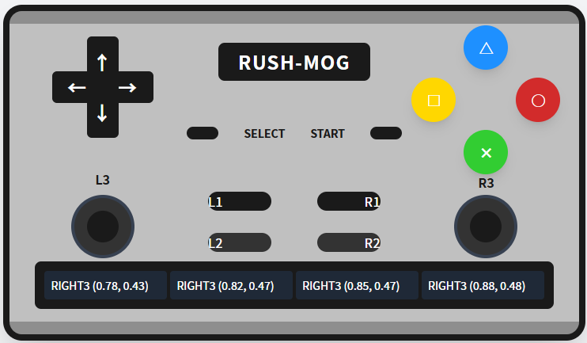

# 远程控制中心说明
远程控制中心是基于ESP8266 NODEMCU实现的网页版手柄控制，ESP8266连接主控的uart2串口，将操作指令下发到主控，进而控制小车。
使用手机或其他移动设备连接ESP8266的WIFI，使用网页进行操作。

# 控制按键说明
左侧8方向按钮，提供8个方向指令。同时在上方提供左转、右转、快速调头按钮。按钮按下触发，松开停止。
右侧4方向按钮，上下方向为加减速，点击生效，实现速度加减一档。 左右按钮为调方向按钮，通过PWM进行方向微调，按钮按下触发，松开恢复相同PWM。
中间部分提供速度展示框。


# 开发环境搭建说明

```
步骤 1：安装必要的工具
安装VS Code
安装Python 3.7+（确保勾选 "Add Python to PATH"）
安装 Git（Windows / Mac）

步骤 2：安装 PlatformIO 插件
打开 VS Code
进入扩展面板（左侧菜单或 Ctrl+Shift+X）
搜索 "PlatformIO" 并安装

步骤 3：开发编译：
点击vscode最下侧 √ 按钮进行编译。（或用 ctrl + alt + B 快捷键）

步骤 4：上传index.html文件
打开左侧在插件安装下方的PlatformIO头像图标，在di_mini/platform中选择 "Upload Filesystem Image"进行执行，上传文件。

步骤 5: 烧录程序
将ESP8266板子使用USB线连接到电脑。
点击vscode最下侧 -> 按钮进行编译。

步骤 6：监控串口
点击vscode最下侧 插头图标的 Serial Monitor 按钮进行编译。

步骤 7：手机连接wifi进行页面访问
在手机WIFI中找到RUSH-MOG，连接后，打开浏览器，输入192.168.4.1，即可访问到页面。

```